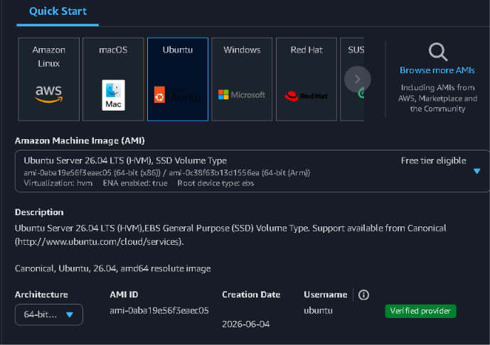
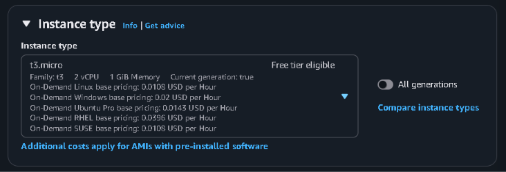
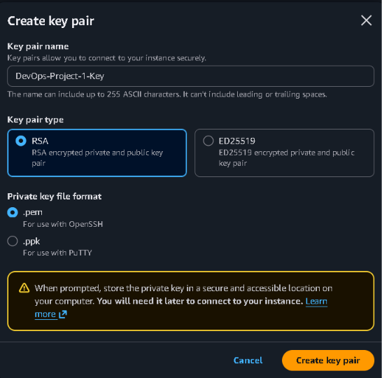
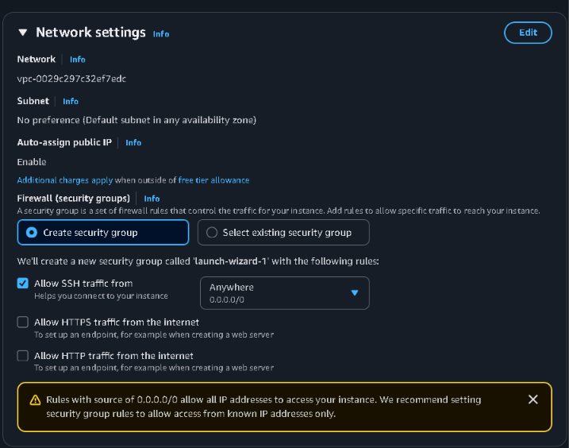
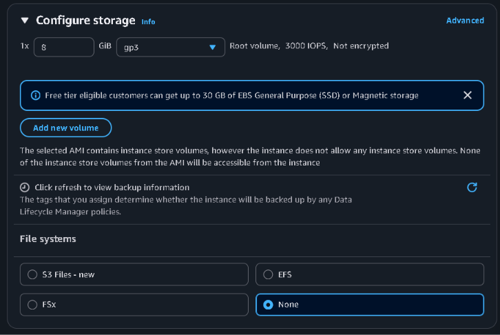
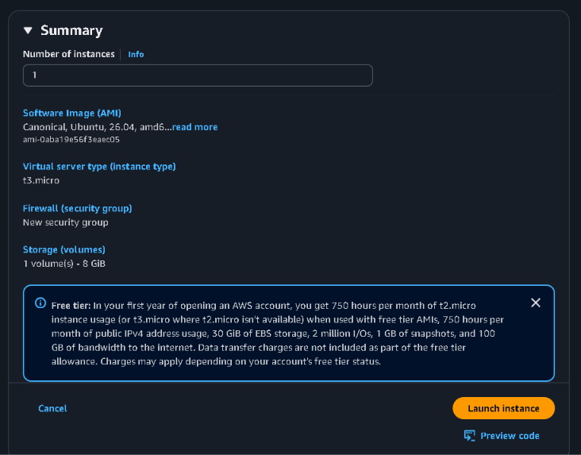
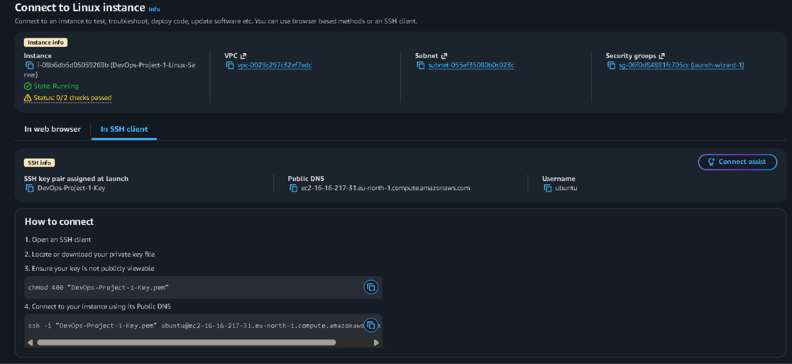
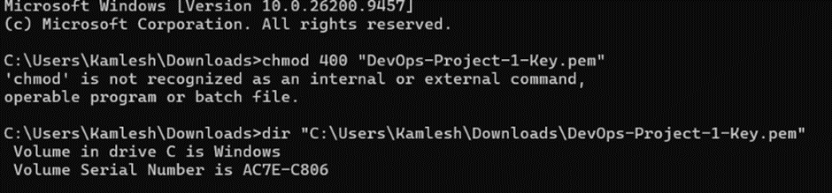
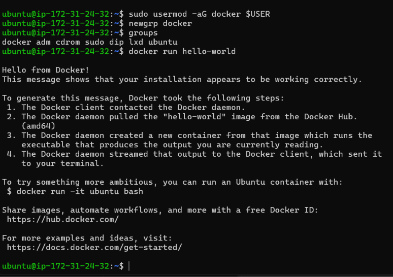

# 🚀 DevOps Project 1: Linux Server Setup on AWS EC2

## 📌 Project Overview

This project demonstrates how to **launch and configure an Ubuntu Linux server on AWS EC2** and install the basic DevOps tools required for development and future **CI/CD projects**.

### The project includes:

- **AWS EC2 instance setup**
- **Ubuntu Linux server configuration**
- **SSH connection**
- **Linux package update and upgrade**
- **Git installation**
- **Java 17 installation**
- **Maven installation**
- **Docker installation**
- **Docker service configuration**
- **Docker user permission configuration**
- **Docker container testing**
- **Final tool verification**

---

## 🎯 Project Objective

Set up an **Ubuntu Linux server on AWS EC2** and install, configure, and verify:

- **Git**
- **Java OpenJDK 17**
- **Apache Maven**
- **Docker**

---

## 🛠 Technologies Used

| Technology | Purpose |
|---|---|
| **AWS EC2** | Cloud virtual server |
| **Ubuntu Linux** | Server operating system |
| **SSH** | Secure remote server connection |
| **Git** | Version control |
| **Java 17** | Java development environment |
| **Maven** | Build automation and dependency management |
| **Docker** | Containerization |
| **Amazon EBS gp3** | EC2 persistent storage |

---

## 🔄 Project Architecture

```text
Windows Laptop
      ↓
AWS Console
      ↓
EC2 Ubuntu Server
      ↓
SSH Connection
      ↓
Update Linux Packages
      ↓
Install Git
      ↓
Install Java 17
      ↓
Install Maven
      ↓
Install Docker
      ↓
Configure Docker
      ↓
Run hello-world Container
      ↓
Verify All Tools
```

---
## ✅ Step 1: Select Ubuntu AMI

I selected **Ubuntu Server** as the operating system for the EC2 instance.

### Configuration

```text
Operating System: Ubuntu Server 26.04 LTS
Architecture: 64-bit (x86)
Default Username: ubuntu
```

### **Why Ubuntu?**

Ubuntu is widely used for:

- Cloud servers
- DevOps environments
- Docker
- CI/CD tools
- Linux administration



---

## ✅ Step 2: Select EC2 Instance Type

I selected:

```text
t3.micro
```

### Instance Resources

```text
2 vCPU
1 GiB Memory
```

This instance is suitable for this **DevOps learning project**.


---

## ✅ Step 3: Create SSH Key Pair

I created a new SSH key pair.

```text
Key Pair Name: DevOps-Project-1-Key
Key Type: RSA
Private Key Format: .pem
```

### **Why is the key pair required?**

The `.pem` private key is used to securely authenticate when connecting to the EC2 server using SSH.

> ⚠️ **Important:** Never upload the `.pem` private key to GitHub.


---

## ✅ Step 4: Configure Security Group

I configured the EC2 **Security Group** to allow SSH access.

```text
Protocol: SSH
Port: 22
```

### **Why SSH?**

SSH provides a secure remote connection between the local computer and the Ubuntu EC2 server.



---

## ✅ Step 5: Configure EBS Storage

Configured:

```text
Storage Size: 8 GiB
Volume Type: gp3
```

### **What is Amazon EBS?**

**Amazon Elastic Block Store (EBS)** acts like a virtual hard disk attached to the EC2 server.

It stores:

- Operating system files
- Applications
- Installed DevOps tools
- Server data

### **Why gp3?**

`gp3` is a **General Purpose SSD** suitable for Linux servers and DevOps learning environments.


---

## ✅ Step 6: Launch EC2 Instance

After reviewing the configuration, I launched the EC2 instance.

The instance was successfully created and reached the **Running** state.


---

## ✅ Step 7: Get SSH Connection Details

AWS provides the SSH command required to connect to the EC2 instance.

### **Command**

```bash
ssh -i "DevOps-Project-1-Key.pem" ubuntu@<EC2-PUBLIC-DNS>
```

### **Command Explanation**

- `ssh` → Starts a secure shell connection
- `-i` → Specifies the private key
- `DevOps-Project-1-Key.pem` → Private key used for authentication
- `ubuntu` → Default Ubuntu username
- `<EC2-PUBLIC-DNS>` → EC2 server address



---
## ❌ SSH Private Key Permission Error

While connecting to the EC2 server, the SSH command itself was correct.

The problem was the **Windows permissions on the `.pem` private key**.

Windows OpenSSH refused to use the key because another Windows group had access to it:

```text
CodexSandboxUsers
```

A private SSH key must have restricted permissions.

### Fix

I used `icacls` in Windows CMD to restrict access to the private key.

First, remove inherited permissions:

```cmd
icacls "C:\Users\Kamlesh\Downloads\DevOps-Project-1-Key.pem" /inheritance:r
```

Then remove the group that had access:

```cmd
icacls "C:\Users\Kamlesh\Downloads\DevOps-Project-1-Key.pem" /remove:g "LAPTOP-MMB8IBCM\CodexSandboxUsers"
```

Then give only the current Windows user read permission:

```cmd
icacls "C:\Users\Kamlesh\Downloads\DevOps-Project-1-Key.pem" /grant:r "%USERNAME%:R"
```

Check the final permissions:

```cmd
icacls "C:\Users\Kamlesh\Downloads\DevOps-Project-1-Key.pem"
```

Then retry the SSH connection:

```cmd
ssh -i "C:\Users\Kamlesh\Downloads\DevOps-Project-1-Key.pem" ubuntu@ec2-16-16-217-31.eu-north-1.compute.amazonaws.com
```

### Result

After correcting the `.pem` file permissions, the SSH connection worked successfully.




## ✅ Step 9: Update Ubuntu Package Repository

### **Command**

```bash
sudo apt update
```

### **Why do we use it?**

`sudo apt update` refreshes Ubuntu's package index so the server knows about the latest packages available from the configured software repositories.

### **How it works**

```text
sudo apt update
      ↓
Check configured repositories
      ↓
Download latest package information
      ↓
Package index refreshed
```

### **Command Explanation**

- `sudo` → Runs the command with administrator privileges
- `apt` → Ubuntu package manager
- `update` → Refreshes the available package information

> **Note:** `sudo apt update` does not install or upgrade packages. It only refreshes the package information.

---
## ✅ Step 10: Upgrade Installed Packages

### **Command**

```bash
sudo apt upgrade -y
```

### **Why do we use it?**

This upgrades currently installed packages to newer available versions.

### **Command Meaning**

- `sudo` → Run with administrator privileges
- `apt` → Ubuntu package manager
- `upgrade` → Upgrade installed packages
- `-y` → Automatically answer **Yes**

### **Difference**

```text
sudo apt update
= Refresh package information

sudo apt upgrade -y
= Install available package upgrades
```


---

## ✅ Step 11: Install Git

### **Command**

```bash
sudo apt install git -y
```

### **Verify Git**

```bash
git --version
```

### **Why Git?**

Git is a **distributed version-control system** used to:

- Track source-code changes
- Maintain project history
- Collaborate with developers
- Create branches
- Work with GitHub repositories

---

## ✅ Step 12: Install Java 17

### **Command**

```bash
sudo apt install openjdk-17-jdk -y
```

### **Verify Java**

```bash
java --version
```

### **Why Java 17?**

Java 17 is a **Long-Term Support (LTS)** version suitable for Java applications and many enterprise and DevOps environments.

---

## ✅ Step 13: Install Apache Maven

### **Command**

```bash
sudo apt install maven -y
```

### **Verify Maven**

```bash
mvn --version
```

### **Why Maven?**

Maven is a **build automation and dependency-management tool** mainly used for Java projects.

It helps with:

- Compiling source code
- Managing dependencies
- Running tests
- Packaging applications

---

## ✅ Step 14: Install Docker Prerequisites

### **Command**

```bash
sudo apt install apt-transport-https ca-certificates curl software-properties-common -y
```

### **Why are these packages required?**

- **`ca-certificates`** → Allows Ubuntu to trust HTTPS certificates
- **`curl`** → Downloads Docker files and signing keys
- **`software-properties-common`** → Provides repository-management utilities
- **`apt-transport-https`** → Supports package downloads over HTTPS

---

## ✅ Step 15: Add Docker Official GPG Key

### **Command**

```bash
curl -fsSL https://download.docker.com/linux/ubuntu/gpg | \
sudo gpg --dearmor -o /usr/share/keyrings/docker.gpg
```

### **Why is the Docker GPG key required?**

Docker digitally signs its software packages.

Ubuntu uses Docker's GPG key to verify:

- The package really came from Docker
- The package has not been modified
- The package can be trusted

```text
Docker Package
      ↓
Signed by Docker
      ↓
Ubuntu Checks Signature
      ↓
Docker GPG Key
      ↓
Trusted Package ✅
```

---

## ✅ Step 16: Add Docker Official Repository

### **Command**

```bash
echo \
"deb [arch=$(dpkg --print-architecture) signed-by=/usr/share/keyrings/docker.gpg] \
https://download.docker.com/linux/ubuntu \
$(. /etc/os-release && echo "$VERSION_CODENAME") stable" | \
sudo tee /etc/apt/sources.list.d/docker.list > /dev/null
```

Refresh the package index:

```bash
sudo apt update
```

### **Why?**

Adding Docker's official repository allows Ubuntu to download Docker Engine packages directly from Docker's repository.

---

## ✅ Step 17: Install Docker Engine

### **Command**

```bash
sudo apt install docker-ce docker-ce-cli containerd.io -y
```

### **Package Explanation**

- **`docker-ce`** → Docker Community Edition Engine
- **`docker-ce-cli`** → Docker command-line interface
- **`containerd.io`** → Container runtime used by Docker

### **Verify Docker**

```bash
docker --version
```

---

## ✅ Step 18: Start Docker Service

### **Command**

```bash
sudo systemctl start docker
```

### **Why?**

This starts the **Docker service immediately**.

---

## ✅ Step 19: Enable Docker at Boot

### **Command**

```bash
sudo systemctl enable docker
```

### **Why?**

This configures Docker to start automatically whenever the Linux server reboots.

---

## ✅ Step 20: Check Docker Service Status

### **Command**

```bash
sudo systemctl status docker
```

### **Expected Result**

```text
Active: active (running)
```

This confirms that the **Docker daemon is running successfully**.

---

## ✅ Step 21: Add Ubuntu User to Docker Group

### **Command**

```bash
sudo usermod -aG docker $USER
```

### **Why?**

By default, Docker commands may require:

```bash
sudo docker ...
```

Adding the current Ubuntu user to the `docker` group allows Docker commands to be run without `sudo`.

---

## ✅ Step 22: Apply Docker Group Permission

### **Command**

```bash
newgrp docker
```

### **Why?**

The new group permission may not immediately become active in the current terminal session.

`newgrp docker` activates the Docker group membership immediately.

### **Verify**

```bash
groups
```

---

## ✅ Step 23: Test Docker

### **Command**

```bash
docker run hello-world
```

### **What happens?**

Docker:

1. Checks whether the `hello-world` image exists locally
2. Downloads the image if necessary
3. Creates a container
4. Runs the container
5. Displays a success message
6. Exits

### **Expected Output**

```text
Hello from Docker!

This message shows that your installation appears to be working correctly.
```


---

## ✅ Step 24: Final DevOps Tool Verification

### **Commands**

```bash
git --version
java --version
mvn --version
docker --version
```

### **Verification**

```text
Git      ✅
Java     ✅
Maven    ✅
Docker   ✅
```


---

# 🐛 Errors and Troubleshooting

## ❌ Error 1: SSH Private Key Permission Error

While connecting from Windows, SSH displayed:

```text
WARNING: UNPROTECTED PRIVATE KEY FILE!
Permissions for the private key are too open.
```

### **Cause**

The `.pem` private key permissions were too open.

### **Fix**

The Windows permissions on the private key were restricted so unauthorized users or groups could not access the file.

After correcting the permissions, the SSH connection worked successfully.

---

## ❌ Error 2: Docker Permission Denied

Initially:

```bash
docker run hello-world
```

returned a Docker socket permission error.

### **Cause**

The Ubuntu user did not yet have active Docker group permissions.

### **Fix**

```bash
sudo usermod -aG docker $USER
newgrp docker
```

Then run:

```bash
docker run hello-world
```

### **Result**

Docker worked successfully **without `sudo`**.

---

# 📋 Complete Command Reference

```bash
# Update Ubuntu package index
sudo apt update

# Upgrade installed packages
sudo apt upgrade -y

# Install Git
sudo apt install git -y

# Verify Git
git --version

# Install Java 17
sudo apt install openjdk-17-jdk -y

# Verify Java
java --version

# Install Maven
sudo apt install maven -y

# Verify Maven
mvn --version

# Install Docker prerequisites
sudo apt install apt-transport-https ca-certificates curl software-properties-common -y

# Add Docker GPG key
curl -fsSL https://download.docker.com/linux/ubuntu/gpg | \
sudo gpg --dearmor -o /usr/share/keyrings/docker.gpg

# Add Docker repository
echo \
"deb [arch=$(dpkg --print-architecture) signed-by=/usr/share/keyrings/docker.gpg] \
https://download.docker.com/linux/ubuntu \
$(. /etc/os-release && echo "$VERSION_CODENAME") stable" | \
sudo tee /etc/apt/sources.list.d/docker.list > /dev/null

# Refresh package repository
sudo apt update

# Install Docker Engine
sudo apt install docker-ce docker-ce-cli containerd.io -y

# Verify Docker
docker --version

# Start Docker
sudo systemctl start docker

# Enable Docker after reboot
sudo systemctl enable docker

# Check Docker service
sudo systemctl status docker

# Add current user to Docker group
sudo usermod -aG docker $USER

# Apply Docker group membership
newgrp docker

# Check groups
groups

# Test Docker
docker run hello-world

# Final verification
git --version
java --version
mvn --version
docker --version
```

---

# 🌍 Real-World Scenario

A new developer joins a team and requires a Linux environment for building and deploying Java applications using Docker.

The DevOps engineer performs the following setup:

```text
Launch Ubuntu Server
        ↓
Connect Using SSH
        ↓
Update Linux
        ↓
Install Git
        ↓
Install Java
        ↓
Install Maven
        ↓
Install Docker
        ↓
Configure Docker Permissions
        ↓
Test Docker Container
        ↓
Verify Environment
```

The server is then ready for **development and future CI/CD pipelines**.

---

# 💡 What I Learned

Through this project, I learned:

- AWS EC2 instance creation
- Ubuntu Linux server configuration
- SSH remote connections
- Linux package management
- Git installation and verification
- Java installation
- Maven installation
- Docker repository configuration
- Docker GPG verification
- Docker Engine installation
- Linux service management using `systemctl`
- Linux group permissions
- Docker container testing
- SSH troubleshooting
- Docker permission troubleshooting

---

# ✅ Project Outcome

Successfully created and configured an **Ubuntu Linux server on AWS EC2**.

```text
AWS EC2            ✅
Ubuntu Linux       ✅
SSH                ✅
Git                 ✅
Java 17             ✅
Apache Maven        ✅
Docker Engine       ✅
Docker Service      ✅
Docker Permissions  ✅
Docker Container    ✅
```

The server is ready for future projects involving:

- **Git and GitHub**
- **Maven**
- **Jenkins CI/CD**
- **Docker**
- **Kubernetes**
- **Ansible**
- **Prometheus & Grafana**
- **Cloud Automation**

---

# 🔗 Project Links

**GitHub Repository:**  
[linux-server-setup](https://github.com/Dhananjaynarwade/linux-server-setup)

**LinkedIn:**  
[Dhananjay Narwade](https://www.linkedin.com/in/dhananjay-narwade-52976139a/)

---

# 👨‍💻 Author

**Dhananjay Narwade**

**GitHub:** [Dhananjaynarwade](https://github.com/Dhananjaynarwade)

**LinkedIn:** [Dhananjay Narwade](https://www.linkedin.com/in/dhananjay-narwade-52976139a/)